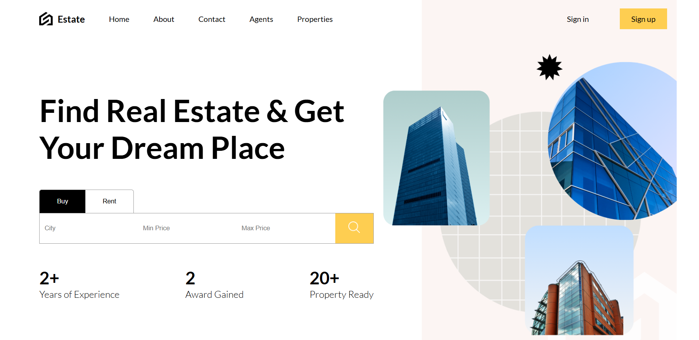
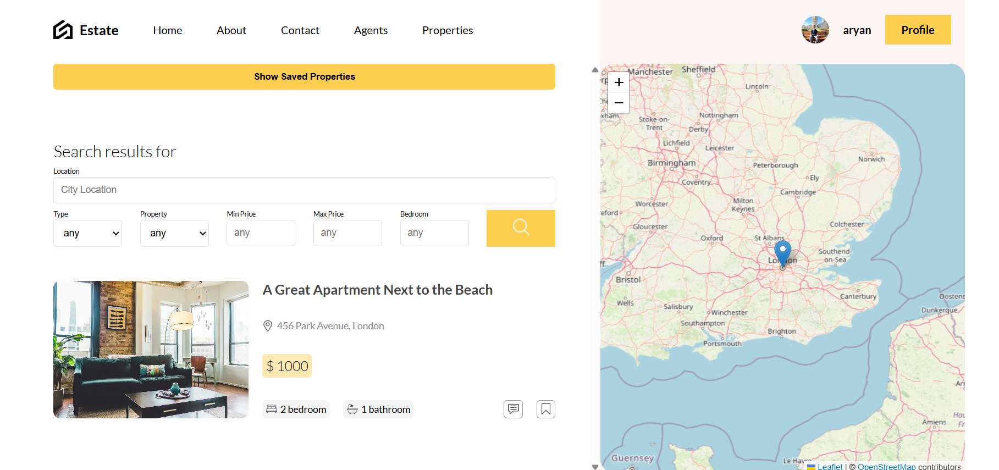

# Real Estate Platform

A fullstack real estate web application for property listings, user management, and real-time chat. Built with React (frontend) and Node.js/Express/Prisma (backend).

##images



## Features
- Browse, search, and filter property listings
- User authentication and profile management
- Post, edit, and save properties
- Real-time chat between users
- Responsive, modern UI

## Tech Stack
- **Frontend:** React, React Router, Zustand, Sass, Leaflet
- **Backend:** Node.js, Express, Prisma, MongoDB, JWT Auth
- **Other:** Vite, Axios, Nodemailer

## Getting Started

### Prerequisites
- Node.js & npm
- MongoDB (local or cloud)

### Backend Setup
1. `cd api`
2. Install dependencies:
   ```bash
   npm install
   ```
3. Configure environment variables in `.env` (see `.env.example` if available)
4. Run database migrations (if using Prisma):
   ```bash
   npx prisma migrate deploy
   ```
5. Start the backend server:
   ```bash
   npm start
   ```

### Frontend Setup
1. `cd client`
2. Install dependencies:
   ```bash
   npm install
   ```
3. Start the development server:
   ```bash
   npm run dev
   ```

The frontend will be available at `http://localhost:5173` (default Vite port).

## Usage
- Register or log in to your account
- Browse and search for properties
- Post your own property listings
- Chat with other users about properties

## Project Structure
- `client/` - React frontend
- `api/` - Node.js/Express backend

## License
This project is licensed under the ISC License.
